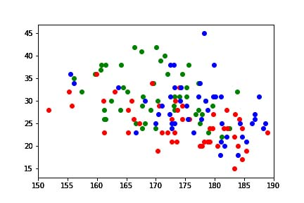

# MLBのア・リーグのホームラン争いをした3人の分析

[Baseball Savant](https://baseballsavant.mlb.com/) より、
トラックマンのデータを取得して分析を行っています。

## 打球速度と打球角度

- 青: 大谷翔平
- 赤: ブラディミール・ゲレーロ Jr
- 緑: サルバドール・ペレス

大谷翔平選手は、打球速度が速い傾向にあり、フライ性もライナー性も両方ある。

ゲレーロJr選手は、速いライナー性の傾向にある。

ペレス選手は、フライボールの傾向にある。

ホームランになりやすいバレルゾーンは、
打球速度が158km/h以上、打球角度が26～30°とされている。
